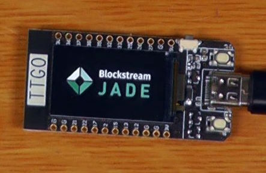
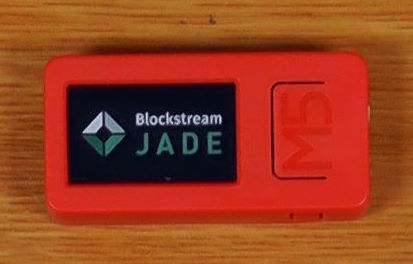
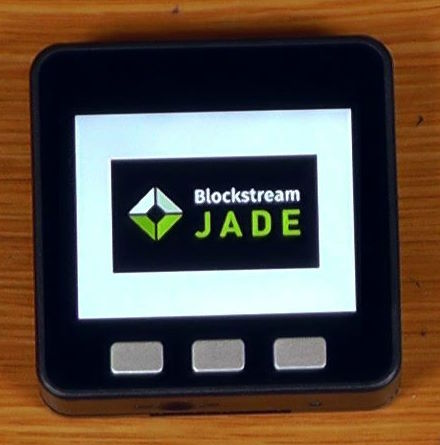
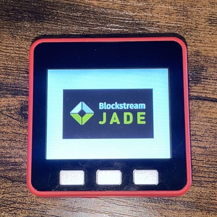

# WARNING
DO NOT ATTEMPT TO FLASH DIY FIRMWARE TO OFFICIAL BLOCKSTREAM JADE HW UNITS

DO NOT ATTEMPT TO FLASH OFFICIAL BLOCKSTREAM FIRMWARE TO YOUR DIY HARDWARE

# Hardware Selection
There are a number of hardware devices that can run Jade firmware with minimal configuration by simply following the build guide in the main readme.

## No-Camera Hardware Options:

### TTGO (Lilygo) T-Display

* [Vendor Product Page](https://www.lilygo.cc/en-ca/products/lilygo%C2%AE-ttgo-t-display-1-14-inch-lcd-esp32-control-board)
* ~$10 USD
* Two button interface (Press both together to select)
* No battery (No ability to monitor battery, even if one is added)
* No case (Low cost case options available)
* USB VendorID:1a86 ProductID:55d4 (Same as retail Jade)
* Typically supports Secure Boot V2

### M5 StickC-Plus

* [Vendor Product Page](https://shop.m5stack.com/collections/m5-controllers/products/m5stickc-plus-esp32-pico-mini-iot-development-kit)
* ~$20 USD
* Two button interface (Long press front button to select)
* Includes 120mAh battery
* Fully assembled with case
* USB VendorID:0403 ProductID:6001 (Different to retail Jade, will require custom Electrum/HWI builds until they add support to these device IDs)
* Typically supports Secure Boot V1

### M5 Stack Basic

* [Vendor Product Page](https://shop.m5stack.com/products/esp32-basic-core-iot-development-kit-v2-6)
* ~$40 USD
* Three button interface (Middle button to select)
* Includes 110mAh battery
* Fully assembled with case
* USB VendorID:1a86 ProductID:55d4 (Same as retail Jade)
* Typically supports Secure Boot V2

### M5 Stack Fire (~$50 USD)

* [Vendor Product Page](https://shop.m5stack.com/collections/m5-controllers/products/m5stack-fire-iot-development-kit-psram-v2-6)
* ~$50 USD
* Extra 8mb PSRAM (When compared to Basic)
* Three button interface (Middle button to select)
* Includes 500mAh battery
* Fully assembled with case
* USB VendorID:1a86 ProductID:55d4 (Same as retail Jade)
* Typically supports Secure Boot V2

# Modifying Configuration Files for Use
Once you are familiar with the process of flashing the firmware using the sdkconfig templates that are included in the /config folder of this repository, there are some additional changes that you should make to these files before using the device with actual funds.

There is also a helper script `tools/mkdefaults.py` to assist, which reads a given sdkconfig defaults file, makes appropriate changes, and writes the results as the top-level `sdkconfig.defaults` file.
(NOTE: this script should be passed a base file and one or more directives - it reads the changes it is going to make for each directive from the `mkdefaults.dat.json` file.)

## Disabling Debug Features
If editing the default development configuration template...

**Add**

    CONFIG_LOG_DEFAULT_LEVEL_NONE=y

**Remove**

    CONFIG_DEBUG_MODE=y

This can be accompished with, for example:
`./tools/mkdefaults.py ./configs/sdkconfig_display.defaults NDEBUG`

## Enabling Secure Boot
If you want to maximise the physical security of your device and prevent it from running firmware that you haven't signed with your signing key, you can also enable Secure Boot.  If applied together with removing the debug features, this is designed to mimic the settings found on a retail Jade device.

_Warning: Doing this cannot be un-done, nor can the signing key that the device will accept be changed._

[Read the official vendor documentation](https://docs.espressif.com/projects/esp-idf/en/latest/esp32/security/secure-boot-v2.html)

**Add**

    CONFIG_ESP32_DISABLE_BASIC_ROM_CONSOLE=y
    CONFIG_SECURE_DISABLE_ROM_DL_MODE=y
    CONFIG_SECURE_BOOT_SIGNING_KEY=<PATH_TO_YOUR_SIGNING_KEY>
    CONFIG_SECURE_BOOT=y
    CONFIG_SECURE_FLASH_ENC_ENABLED=y
    CONFIG_SECURE_FLASH_ENCRYPTION_MODE_RELEASE=y
    CONFIG_ESP32_REV_MIN_3=y

_Depending on the hardare you have selected, you may need to remove the last line that requires a minimum of Rev3 hardware..._

**Remove**

    CONFIG_EFUSE_VIRTUAL=y
    CONFIG_ESP32_REV_MIN_1=y

This can be accompished with, for example:
`./tools/mkdefaults.py ./configs/sdkconfig_display.defaults NDEBUG SECURE`

# Disabling Bluetooth
If you would prefer to completely disable Bluetooth, you can also make the following modifications to your configuration template.

**Add**

    CONFIG_APP_NO_BLOBS=y
    CONFIG_MBEDTLS_ECP_RESTARTABLE=y
    CONFIG_MBEDTLS_CMAC_C=y

**Remove**

    CONFIG_BT_ENABLED=y
    CONFIG_BT_NIMBLE_ENABLED=y
    CONFIG_BT_NIMBLE_MEM_ALLOC_MODE_EXTERNAL=y
    CONFIG_BT_NIMBLE_MAX_CONNECTIONS=1
    # CONFIG_BT_NIMBLE_ROLE_CENTRAL is not set
    # CONFIG_BT_NIMBLE_ROLE_BROADCASTER is not set
    # CONFIG_BT_NIMBLE_ROLE_OBSERVER is not set
    CONFIG_BT_NIMBLE_NVS_PERSIST=y
    # CONFIG_BT_NIMBLE_SM_LEGACY is not set
    CONFIG_BT_NIMBLE_SVC_GAP_DEVICE_NAME="j"
    CONFIG_BT_NIMBLE_GAP_DEVICE_NAME_MAX_LEN=11
    CONFIG_BT_NIMBLE_ATT_PREFERRED_MTU=517
    CONFIG_BTDM_CTRL_BLE_MAX_CONN=1
    # CONFIG_BTDM_CTRL_FULL_SCAN_SUPPORTED is not set
    # CONFIG_ESP32_WIFI_SW_COEXIST_ENABLE is not set

This can be accompished with, for example:
`./tools/mkdefaults.py ./configs/sdkconfig_display.defaults NORADIO`

# Upgrading firmware via OTA
If you have enabled secure boot with the settings suggested above you will need to do firmware updates via OTA.

An example command to do this using the jade.bin file in the /build folder would be:

`python jade_ota.py --noagent`
