# WARNING
DO NOT ATTEMPT TO FLASH DIY FIRMWARE TO OFFICIAL BLOCKSTREAM JADE HW UNITS

DO NOT ATTEMPT TO FLASH OFFICIAL BLOCKSTREAM FIRMWARE TO YOUR DIY HARDWARE

# Hardware Selection
There are a number of hardware devices that can run Jade firmware with minimal configuration by simply following the build guide in the main readme.

## No-Camera Hardware Options:

### TTGO (Lilygo) T-Display
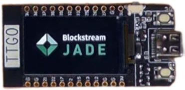
* [Vendor Product Page](https://www.lilygo.cc/en-ca/products/lilygo%C2%AE-ttgo-t-display-1-14-inch-lcd-esp32-control-board)
* ~$10 USD
* Two button interface (Press both together to select)
* No battery included; battery connector present; battery indicator works when a battery is attached
* Base model has no case
  * [OEM Model K164](https://www.lilygo.cc/products/lilygo%C2%AE-ttgo-t-display-1-14-inch-lcd-esp32-control-board?variant=42720264683701) and other low cost case options available)
* USB VendorID:1a86 ProductID:55d4 (Same as retail Jade)
* Typically supports Secure Boot V2
* Build configuration: `configs/sdkconfig_display_ttgo_tdisplay.defaults`

### TTGO (Lilygo) T-Display S3
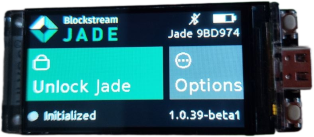
* [Vendor Product Page](https://www.lilygo.cc/products/t-display-s3)
* ~$15 USD
* Two button interface (Press both together to select)
* No battery included; battery connector present; battery indicator works when a battery is attached
* Base model has no case
* USB VendorID:303a ProductID:4001 (Different to retail Jade, will require custom Electrum/HWI builds until they add support to these device IDs)
* Typically supports Secure Boot V2
* Build configuration: `configs/sdkconfig_display_ttgo_tdisplays3.defaults`

### M5Stack M5StickC PLUS
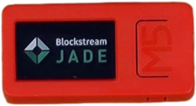
* [Vendor Product Page](https://shop.m5stack.com/collections/m5-controllers/products/m5stickc-plus-esp32-pico-mini-iot-development-kit)
* ~$20 USD (EOL)
* Two button interface (Long press front button to select)
* Includes 120mAh battery
* Fully assembled with case
* USB VendorID:0403 ProductID:6001 (Different to retail Jade, will require custom Electrum/HWI builds until they add support to these device IDs)
* Typically supports Secure Boot V1
* Build configuration: `configs/sdkconfig_display_m5stickcplus.defaults`

### M5Stack M5StickC PLUS 2
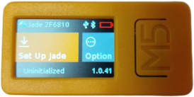
* [Vendor Product Page](https://shop.m5stack.com/products/m5stickc-plus2-esp32-mini-iot-development-kit)
* ~$20 USD (EOL)
* Extra 2mb PSRAM (When compared to M5StickC PLUS)
* Two button interface (Long press front button to select)
* Includes 200mAh battery
* Fully assembled with case
* USB VendorID:0403 ProductID:6001 (Different to retail Jade, will require custom Electrum/HWI builds until they add support to these device IDs)
* Typically supports Secure Boot V2
* Build configuration: `configs/sdkconfig_display_m5stickcplus2.defaults`

### M5Stack Basic Core
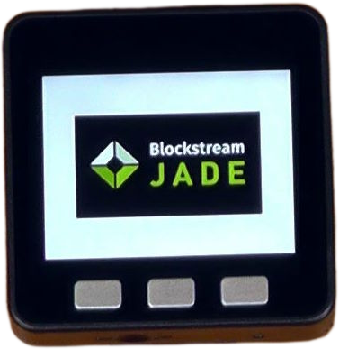
* [Vendor Product Page](https://shop.m5stack.com/products/esp32-basic-core-lot-development-kit-v2-7)
* ~$40 USD
* Three button interface (Middle button to select)
* Includes 110mAh battery
* Fully assembled with case
* USB VendorID:1a86 ProductID:55d4 (Same as retail Jade)
* Typically supports Secure Boot V2
* Build configuration: `configs/sdkconfig_display_m5blackgray.defaults`

### M5Stack FIRE (~$50 USD)
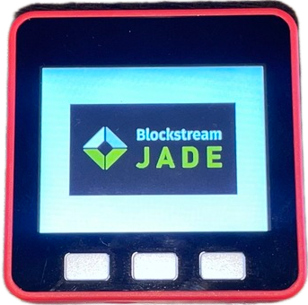
* [Vendor Product Page](https://shop.m5stack.com/collections/m5-controllers/products/m5stack-fire-iot-development-kit-psram-v2-6)
* ~$50 USD (EOL)
* Extra 8mb PSRAM (When compared to Basic)
* Three button interface (Middle button to select)
* Includes 500mAh battery
* Fully assembled with case
* USB VendorID:1a86 ProductID:55d4 (Same as retail Jade)
* Typically supports Secure Boot V2
* Build configuration: `configs/sdkconfig_display_m5fire.defaults`

### M5Stack Core2
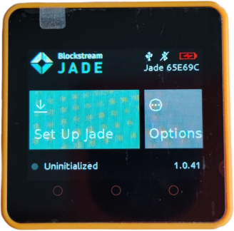
* [Vendor Product Page](https://shop.m5stack.com/products/m5stack-core2-esp32-iot-development-kit-v1-3)
* ~$43 USD
* ESP32 board with a 320x240 touchscreen
* No camera; includes battery and power management
* Touchscreen interface; no external wiring required
* Build configuration: `configs/sdkconfig_display_m5core2.defaults`

### TTGO (Lilygo) T-Watch S3
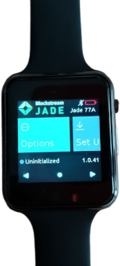
* [Vendor Product Page](https://lilygo.cc/en-us/products/t-watch-s3?srsltid=AfmBOooRT8Tptcg2Y1Nz4_HHRImKJuIfVPGdPR8So__hV4-rzDCnkWb2)
* ~$43 USD
* ESP32-S3 watch with a 240x200 touchscreen
* No camera; includes battery and AXP2101 power management
* Touchscreen interface; no external wiring required
* Requires the 16MB-flash board variant selected by the defaults file
* Build configuration: `configs/sdkconfig_display_ttgo_twatchs3.defaults`

## Camera-Enabled Hardware Options:

### Lilygo T-Camera Plus + Digital Pushbutton
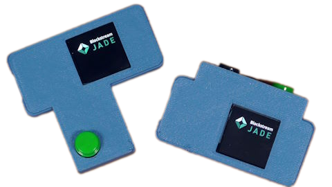
* Costs between ~$30 USD and ~50 USD depending on hardware options you want. (See below)
* Single button interface
* Has the option of adding a battery  and soldering new on-button)
* USB VendorID:1a86 ProductID:55d4 (Same as retail Jade)
* Typically supports Secure Boot V2
* Hardware Required (Some soldering required for all options)
  * [Lilygo T-Camera Plus](http://www.lilygo.cn/prod_view.aspx?TypeId=50067&Id=1272&FId=t3:50067:3)
  * Digital Push button (Or two if you intend on using a battery)
  * 3.7v lithium battery (Optional, this also requires removing a 0ohm resistor from the PCB and connecting an alternative power button)
  * MicroSD Sniffer (Optional, larger device but MUCH easier to solder)
  * [3d printed case, example STL files available here](https://www.printables.com/model/493449-cases-for-diy-jade-based-on-lilygo-t-camera-plus)
* [Assembly Guide & Hardware Notes](./t-camera-plus/)
* Build configuration: `configs/sdkconfig_diycam_tcameraplus.defaults`

### ESP32-Wrover-Cam Board + 1.14 Pico LCD Hat (Or Waveshare 1.3 LCD Hat)
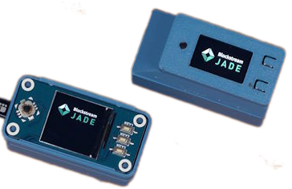
* Costs between $20 and $30 USD depending on whether you go for official or clone hardware
* Three button interface
* No simple option for battery
* USB VendorID:1a86 ProductID:7523 (Different to retail Jade)
* Typically supports Secure Boot V2
* Hardware Required (No Soldering Required)
  * [Freenove ESP32-Wrover CAM](https://github.com/Freenove/Freenove_ESP32_WROVER_Board) (Or any clone)
  * [Waveshare Pico LCD 1.14](https://www.waveshare.com/wiki/Pico-LCD-1.14)
  * [Waveshare 1.3inch LCD Hat](https://www.waveshare.com/wiki/1.3inch_LCD_HAT)
  * Dupont Female to Male Connectors (Short ones, so 10cm)
  * [3d printed case, example STL files available here](https://www.printables.com/model/493229-cases-for-diy-jade-based-on-esp32-wrover-cam)
* [Assembly Guide & Hardware Notes](./esp32-wrover-cam/)
* Build configuration: `configs/sdkconfig_diycam_esp32-wrover-cam.defaults`

### ESP32-Cam Board + 1.14 Pico LCD + Digital Pushbutton
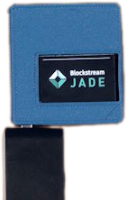
* Costs between $10 and $20 USD depending on whether you want an integrated programmer/USB interface
* One button interface
* No simple option for battery
* No integrated USB-Serial device, so you have a few options (Including running without one after initial firmware flash)
  * ESP32-CAM-MB: USB VendorID:1a86 ProductID:7523 (Different to retail Jade)
  * CP2104: USB VendorID:1a86 ProductID:55d4 (Same as retail Jade)
* Typically supports Secure Boot V2
* Hardware Required (No Soldering Required)
  * [ESP32- CAM](https://docs.ai-thinker.com/en/esp32-cam) (Or any clone)
  * 135*240 RGB, ST7789, SPI, LCD Board. (You could also use the Waveshare Pico 1.14 hat as above)
  * Digital Push button
  * Dupont Female to Female Connectors (Short ones, so 10cm)
  * [3d printed case, example STL files available here](https://www.printables.com/model/493485-cases-for-diy-jade-based-on-esp32-cam)
* [Assembly Guide & Hardware Notes](./esp32-cam/)
* Build configuration: `configs/sdkconfig_diycam_esp32-cam.defaults`

### ESP32-S3-DevKitC-1 + ST7789 1.14" LCD + OV2640 Camera
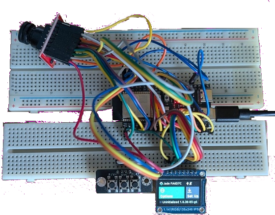
* Costs ~$10-15 USD for the dev board + ~$5-10 USD for display and camera modules
* Three button interface (left / select / right)
* USB VendorID:303a ProductID:1001 (Different to retail Jade)
* Typically supports Secure Boot V2
* Hardware Required (No Soldering Required)
  * [ESP32-S3-DevKitC-1](https://docs.espressif.com/projects/esp-dev-kits/en/latest/esp32s3/esp32-s3-devkitc-1/index.html) (N8R8 variant, 8MB flash + 8MB Octal PSRAM)
  * ST7789 1.14" 135*240 SPI LCD module
  * OV2640 camera module (STM32-compatible red module with onboard oscillator)
  * Dupont wires
* [Assembly Guide & Hardware Notes](./esp32-s3-devkitc-1/)
* Build configuration: `configs/sdkconfig_diycam_esp32-s3-devkitc-1.defaults`

### M5Stack CoreS3
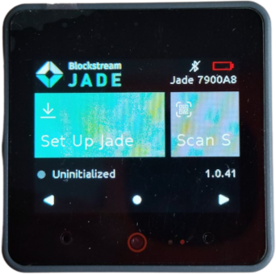
* [Vendor Product Page](https://shop.m5stack.com/products/m5stack-cores3-esp32s3-iotdevelopment-kit)
* ~$60 USD
* ESP32-S3 board with a 320x200 touchscreen and integrated camera
* Includes battery and power management; no external wiring required
* Requires the 16MB-flash CoreS3 variant selected by the defaults file
* Build configuration: `configs/sdkconfig_display_m5cores3.defaults`

### TTGO (Lilygo) T-Display S3 Pro Camera
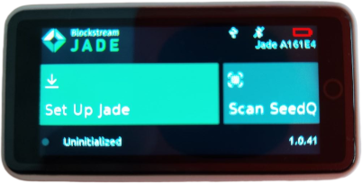
* [Vendor Product Page](https://lilygo.cc/en-us/products/t-display-s3-pro)
* ~$50 USD
* ESP32-S3 board with integrated camera, 480x222 display and battery support
* Integrated controls and display; no external wiring required
* Requires the 8MB-flash board variant selected by the defaults file
* Build configuration: `configs/sdkconfig_display_ttgo_tdisplays3procamera.defaults`

### Waveshare S3 Touch LCD 2
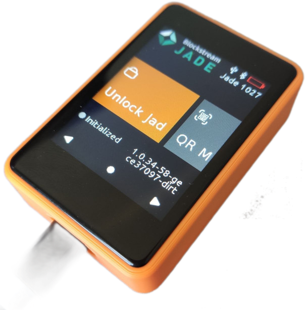
* [Vendor Product Page](https://www.waveshare.com/esp32-s3-touch-lcd-2.htm)
* ~$20 USD
* Touch screen interface (virtual buttons)
* Wifi/Bluetooth
* Easy USB debugging and flashing 
* Typically supports Secure Boot V2
* Hardware Required (No Soldering Required)
  * [Waveshare S3 Touch LCD 2](https://www.waveshare.com/product/esp32-s3-touch-lcd-2.htm)
  * OV5640 Camera module (optionally included in purchase)
  * 3.7V Lithium battery with MX1.25 connector (optional)
* Build configuration: `configs/sdkconfig_display_waveshares3_touch_lcd2.defaults`
  (Bluetooth is enabled; see the next section to disable it.)
* [Assembly Guide & Hardware Notes](./waveshare/)  

# Modifying Configuration Files for Use
Once you are familiar with the process of flashing the firmware using the sdkconfig templates that are included in the /config folder of this repository, there are some additional changes that you should make to these files before using the device with actual funds.

There is also a helper script `tools/mkdefaults.py` to assist, which reads a given sdkconfig defaults file, makes appropriate changes, and writes the results as the top-level `sdkconfig.defaults` file.
(NOTE: this script should be passed a base file and one or more directives - it reads the changes it is going to make for each directive from the `mkdefaults.dat.json` file.)

## Disabling Debug Features
If editing the default development configuration template...

**Add**

    CONFIG_LOG_DEFAULT_LEVEL_NONE=y

**Remove**

    CONFIG_DEBUG_MODE=y

This can be accompished with, for example:
`./tools/mkdefaults.py ./configs/sdkconfig_display.defaults NDEBUG`

## Enabling Secure Boot
If you want to maximise the physical security of your device and prevent it from running firmware that you haven't signed with your signing key, you can also enable Secure Boot.  If applied together with removing the debug features, this is designed to mimic the settings found on a retail Jade device.

_Warning: Doing this cannot be un-done, nor can the signing key that the device will accept be changed._

[Read the official vendor documentation](https://docs.espressif.com/projects/esp-idf/en/latest/esp32/security/secure-boot-v2.html)

**Add**

    CONFIG_ESP32_DISABLE_BASIC_ROM_CONSOLE=y
    CONFIG_SECURE_DISABLE_ROM_DL_MODE=y
    CONFIG_SECURE_BOOT_SIGNING_KEY=<PATH_TO_YOUR_SIGNING_KEY>
    CONFIG_SECURE_BOOT=y
    CONFIG_SECURE_FLASH_ENC_ENABLED=y
    CONFIG_SECURE_FLASH_ENCRYPTION_MODE_RELEASE=y
    CONFIG_ESP32_REV_MIN_3=y

_Depending on the hardware you have selected, you may need to remove the last line that requires a minimum of Rev3 hardware..._

**Remove**

    CONFIG_ESP32_REV_MIN_1=y

This can be accompished with, for example:
`./tools/mkdefaults.py ./configs/sdkconfig_display.defaults NDEBUG SECURE`

# Disabling Bluetooth
If you would prefer to completely disable Bluetooth, you can also make the following modifications to your configuration template.

**Add**

    CONFIG_APP_NO_BLOBS=y
    CONFIG_MBEDTLS_ECP_RESTARTABLE=y
    CONFIG_MBEDTLS_CMAC_C=y

**Remove**

    CONFIG_BT_ENABLED=y
    CONFIG_BT_NIMBLE_ENABLED=y
    CONFIG_BT_NIMBLE_MEM_ALLOC_MODE_EXTERNAL=y
    CONFIG_BT_NIMBLE_MAX_CONNECTIONS=1
    # CONFIG_BT_NIMBLE_ROLE_CENTRAL is not set
    # CONFIG_BT_NIMBLE_ROLE_BROADCASTER is not set
    # CONFIG_BT_NIMBLE_ROLE_OBSERVER is not set
    CONFIG_BT_NIMBLE_NVS_PERSIST=y
    # CONFIG_BT_NIMBLE_SM_LEGACY is not set
    CONFIG_BT_NIMBLE_SVC_GAP_DEVICE_NAME="j"
    CONFIG_BT_NIMBLE_GAP_DEVICE_NAME_MAX_LEN=11
    CONFIG_BT_NIMBLE_ATT_PREFERRED_MTU=517
    CONFIG_BTDM_CTRL_BLE_MAX_CONN=1
    # CONFIG_BTDM_CTRL_FULL_SCAN_SUPPORTED is not set
    # CONFIG_ESP32_WIFI_SW_COEXIST_ENABLE is not set

This can be accompished with, for example:
`./tools/mkdefaults.py ./configs/sdkconfig_display.defaults NORADIO`

# Upgrading firmware via OTA
If you have enabled secure boot with the settings suggested above you will need to do firmware updates via OTA.

An example command to do this using the jade.bin file in the /build folder would be:

`python jade_ota.py --noagent`
