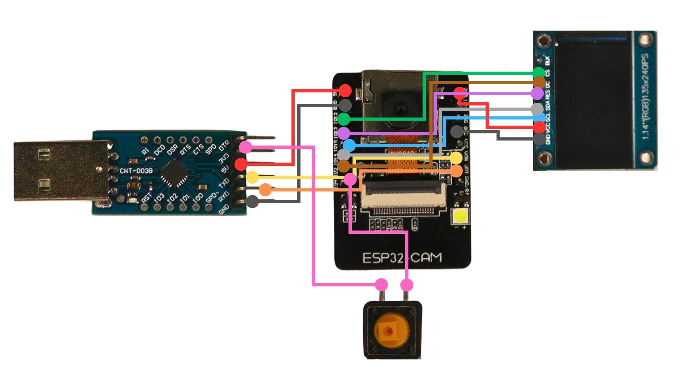

# ESP32-Cam Assembly

**Note on Programmers and USB/Serial Bridges for ESP32-CAM**

The ESP32-Cam doesn't have an onboard USB/Serial converter, but is commonly shipped with an ESP32-CAM-MB interface that can simplify programming. Unfortunately the ESP32-CAM-MB also makes it very difficult to access IO pins, so it's possible to us a different USB/Serial interface. (A CP2104 is a good option as it's low cost, provides both 5v and 3.3v and also allows gives the best compatibility with wallet software)

Once you have flashed the firmware, it's also possible to run the device without any USB/Serial bridge and supplying 5v directly to the ESP32-Cam. (This obviously prevents it being used via USB)

## Programmer Pins (For CP2104/CP2102)
| Function Pin (On CP2104)     | Pin Number (On ESP32) |
| ----------- | ----------- |
| DTR | Not Connected | 
| 3V3 | Not to ESP32, Connect to input button  (see below) | 
| 5V | 5V | 
| TXD | UOT |
| RXD | UOR | 
| GND | GND |

## Power Pins
| Function Pin (On Display)     | Pin Number (On ESP32) |
| ----------- | ----------- |
| VCC | VCC |
| GND | GND | 

## Display Pins
| Function Pin (On Display)     | Pin Number (On ESP32) |
| ----------- | ----------- |
| SCL     | 15       |
| SCA| 14
| CS | 12        |
| DC | 2 |
| RST | 13 |
| BLK | Not Connected |

## Input Pins
| Function Pin    | Pin Number (On ESP32) |
| ----------- | ----------- |
| B | 4 |

_Note, this pin is shared with the onboard LED, so will be used in "Active High" mode, meaning that rather than connecting via a push button to GND, it connects to 3.3v on the CP2104. (or 5v on the ESP32-CAM)_

# Connection Diagram
