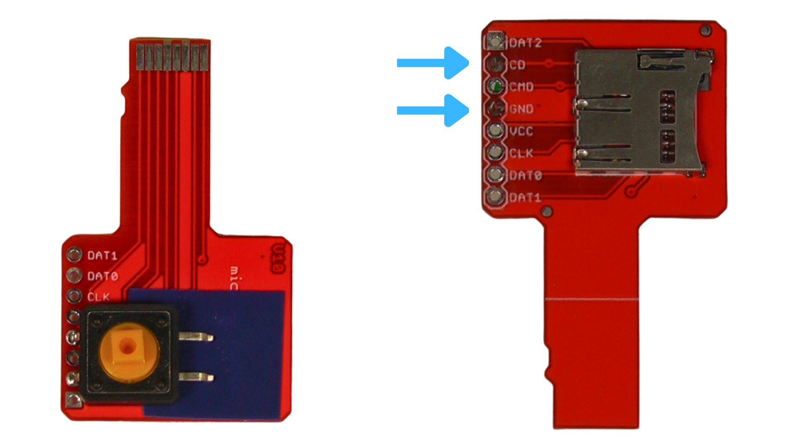
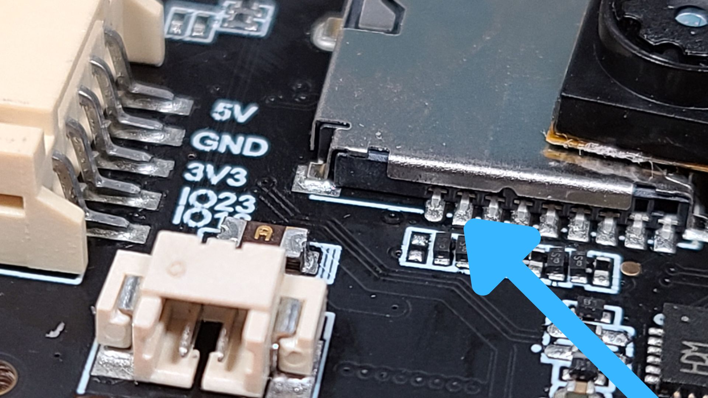
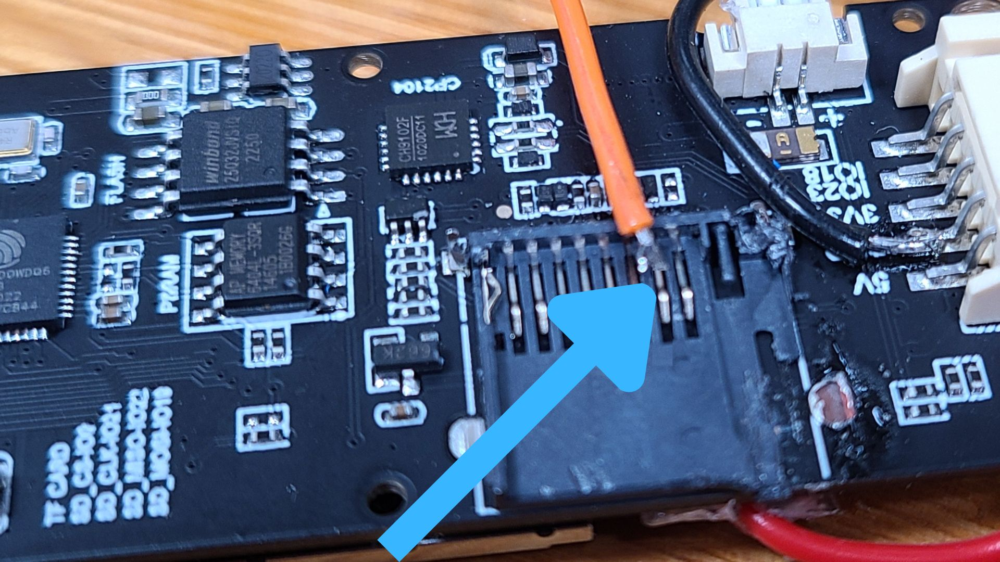
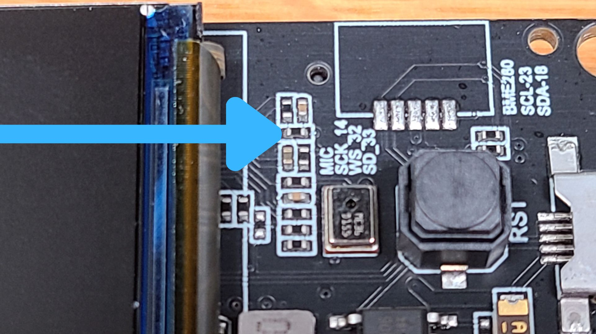
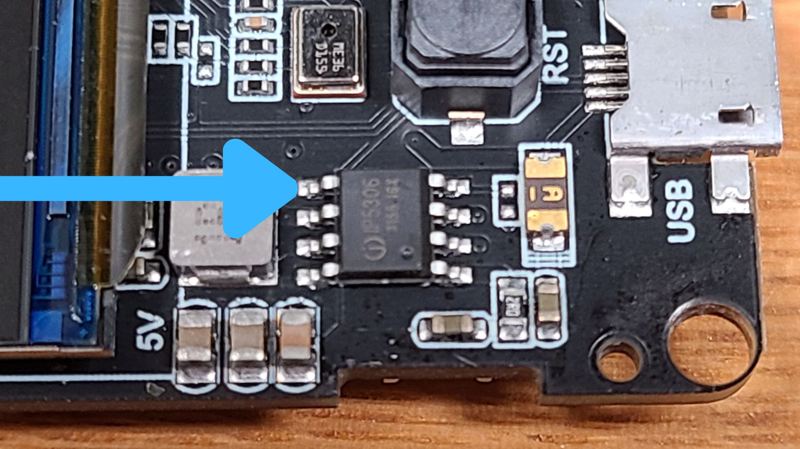

# Lilygo T-Camera-Plus Assembly

## Accessing Input Pins
The T-Camear-Plus has no readily available IO pins, but there is one spare pin that is wired in to the MicroSD slot.

### Via MicroSD Sniffer
One very simple way to access this IO pin is via a MicroSD sniffer, soldering a digital push button between the CD and GND pins. 

### Via Soldering to PCB
Alternatively, you can solder directly to the pin on the MicroSD socket. 

The pad is quite small and you want to be sure that you don't create a short between the pin and the SD holder housing or any other components, so it's much easier if you remove the cover of the MicroSD card slot.

After carefully cutting away the cover of the SD reader, it's relatively easy to solder directly on to the pin or the pad. (Just don't bend the pin itself much, as it will fatigue and break if you bend it back and forwards)

You can also then solder a wire on to the nearby GND pad and then connect these wires to a digital push button. 

## Battery Modifications
The T-Camera-Plus comes with a battery socket, a pre-wired plug (that can be soldered on to any 3.7v lithium battery) and an onboard power management unit, IP5306. 

By default, the T-Camera-Plus has a button on the front which is shared by both the RST/EN pin and the power button on the onboard IP5306. What this means is that even when the device is off, the battery will slowly discharge, unless a small modification is made.

The onboard power+reset button can be disconnected from the power management unit by removing the 0 ohm resistor, R56. (Once disconnected, it will still reset the device, just won't be ablet to turn it on/off anymore)

Once this has been removed, you will need to add a new power button that connects directly to the IP5306 power button pin.

You can also then run a wire for this button to any available GND.

Once completed, the device will turn on with two quick button presses and off with a single press. 